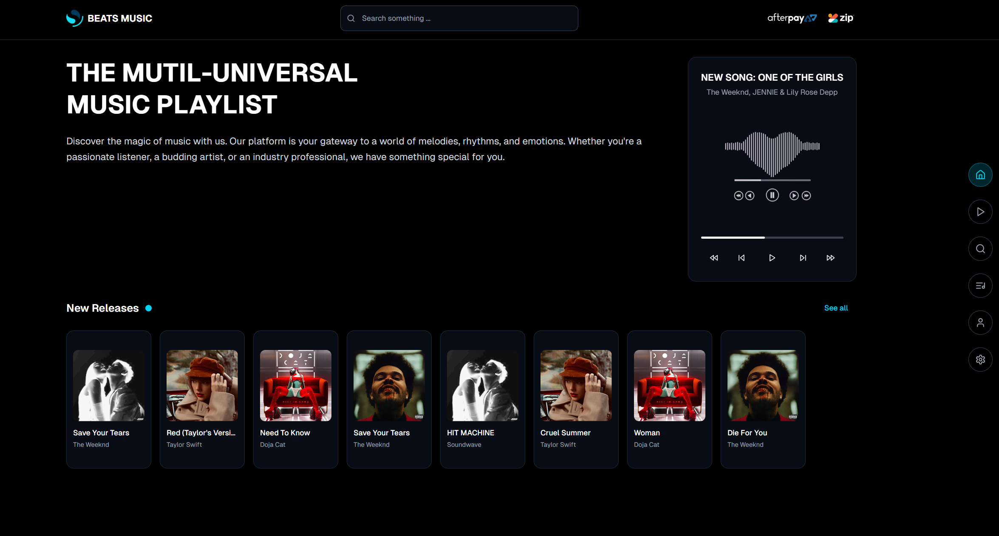
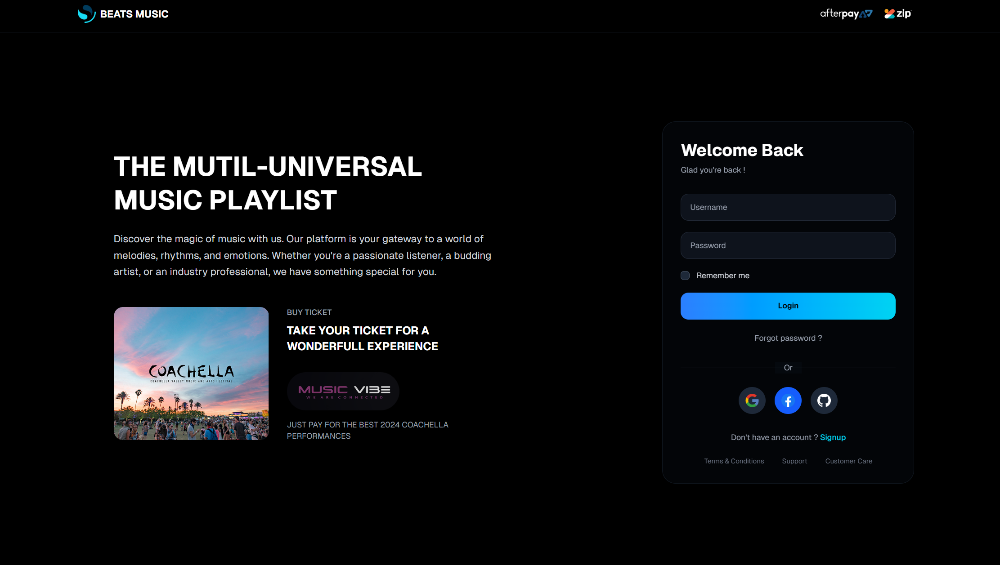
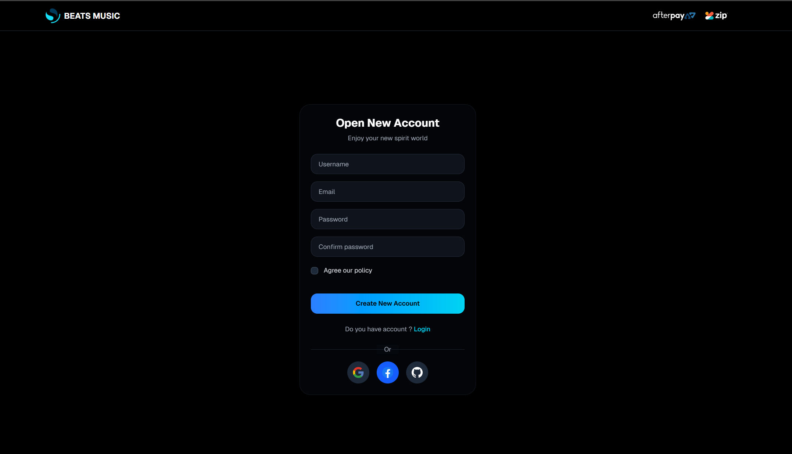
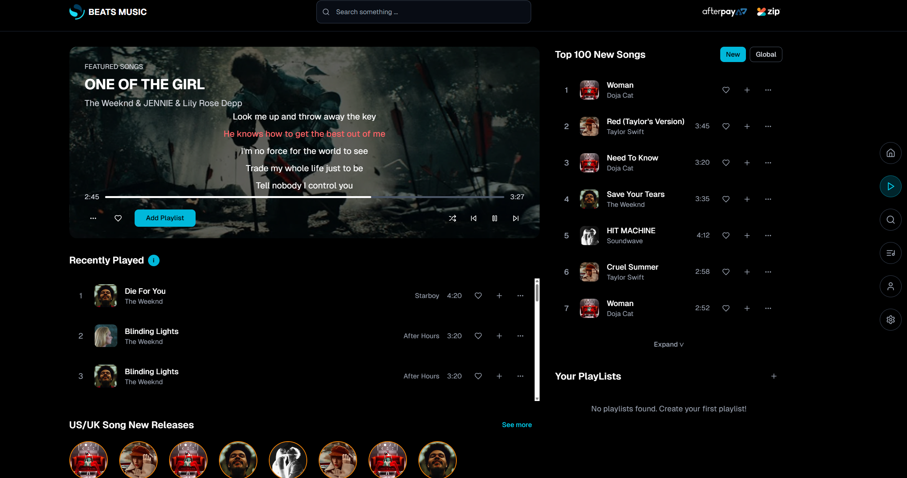
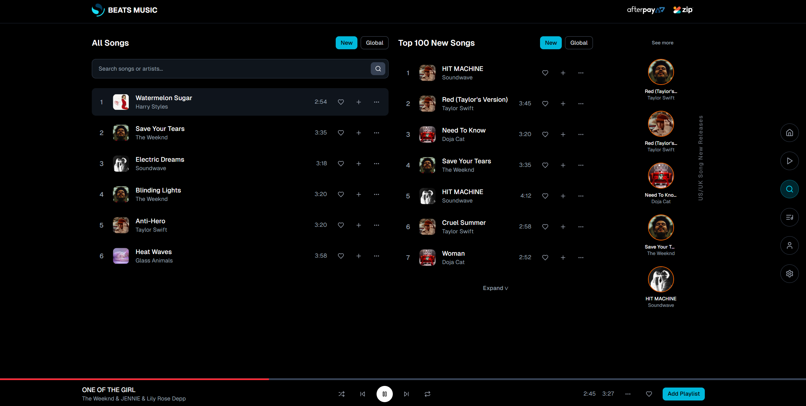

# 🎵 Beats Music Streaming Platform

A modern, feature-rich music streaming web application built with Next.js, featuring user authentication, music discovery, playlists, and a beautiful responsive interface.

## 📋 Table of Contents

- [Overview](#overview)
- [✨ Features](#-features)
- [🚀 Tech Stack](#-tech-stack)
- [📷 Screenshots](#-screenshots)
- [🌐 Live Demo](#-live-demo)
- [📂 Repository](#-repository)
- [⚡ Quick Start](#-quick-start)
- [🔧 Installation](#-installation)
- [⚙️ Configuration](#️-configuration)
- [🎯 Usage](#-usage)
- [📱 Responsive Design](#-responsive-design)
- [🧪 Testing](#-testing)
- [🗂️ Project Structure](#️-project-structure)
- [🔒 Authentication](#-authentication)
- [🎨 UI Components](#-ui-components)
- [🤝 Contributing](#-contributing)
- [📄 License](#-license)
- [🙏 Acknowledgments](#-acknowledgments)

## Overview

Beats Music is a comprehensive music streaming platform that offers users an immersive music discovery and listening experience. Built with modern web technologies, it provides seamless authentication, intuitive navigation, and a rich set of features for music enthusiasts.

### Key Highlights

- **🎵 Multi-Universal Music Playlist** - Discover and organize your favorite tracks
- **🔐 Secure Authentication** - Email/password and social login options
- **🎨 Modern Dark UI** - Sleek, responsive design with smooth animations
- **📱 Mobile-First Design** - Optimized for all device sizes
- **⚡ Performance Optimized** - Fast loading and smooth interactions
- **🔍 Advanced Search** - Find music with intelligent search capabilities

## ✨ Features

### 🎵 Music Features
- **Music Player** - Full-featured audio player with play/pause, skip, and progress controls
- **Heart-shaped Waveform Visualization** - Unique audio visualization
- **Recently Played** - Track your listening history
- **Top Charts** - Discover trending music
- **New Releases** - Stay updated with the latest music
- **Playlists** - Create and manage custom playlists
- **Add to Playlist** - Organize your favorite tracks
- **Album Grid View** - Browse music in an attractive grid layout

### 👤 User Features
- **User Registration & Login** - Secure account creation and authentication
- **Social Login** - Sign in with Google, GitHub, or Facebook
- **User Profile** - Personalized user experience
- **Remember Me** - Persistent login sessions
- **Password Recovery** - Forgot password functionality

### 🎨 Interface Features
- **Dark Theme** - Beautiful dark mode interface
- **Responsive Design** - Works perfectly on desktop, tablet, and mobile
- **Navigation Sidebar** - Easy access to all sections
- **Search Bar** - Quick search functionality across all pages
- **Loading States** - Smooth loading animations
- **Toast Notifications** - User feedback for actions

### 🔍 Discovery Features
- **Global Search** - Search across all music content
- **Advanced Search Results** - Comprehensive search with filtering
- **Music Discovery** - Explore new music through various sections
- **Category Browsing** - Browse music by different categories

## 🚀 Tech Stack

### Frontend
- **[Next.js 14](https://nextjs.org/)** - React framework with App Router
- **[React 18](https://reactjs.org/)** - UI library
- **[TypeScript](https://www.typescriptlang.org/)** - Type safety
- **[Tailwind CSS](https://tailwindcss.com/)** - Utility-first CSS framework
- **[next-themes](https://github.com/pacocoursey/next-themes)** - Theme management

### UI Components & Design
- **[Radix UI](https://www.radix-ui.com/)** - Accessible, unstyled UI components
- **[Lucide React](https://lucide.dev/)** - Beautiful icons
- **[Class Variance Authority](https://cva.style/)** - Component variants
- **[Tailwind Merge](https://github.com/dcastil/tailwind-merge)** - Utility merging
- **[Geist Font](https://vercel.com/font)** - Beautiful typography

### Backend & Database
- **[Firebase](https://firebase.google.com/)** - Backend as a Service
- **[Firebase Auth](https://firebase.google.com/products/auth)** - Authentication service
- **[Firestore](https://firebase.google.com/products/firestore)** - NoSQL database
- **[Firebase Admin](https://firebase.google.com/docs/admin/setup)** - Server-side Firebase SDK

### Form Handling & Validation
- **[React Hook Form](https://react-hook-form.com/)** - Form management
- **[Zod](https://zod.dev/)** - Schema validation
- **[@hookform/resolvers](https://github.com/react-hook-form/resolvers)** - Form validation resolvers

### Additional Libraries
- **[Embla Carousel](https://www.embla-carousel.com/)** - Carousel functionality
- **[React Firebase Hooks](https://github.com/csfrequency/react-firebase-hooks)** - Firebase React hooks
- **[Sonner](https://sonner.emilkowal.ski/)** - Toast notifications
- **[Recharts](https://recharts.org/)** - Charts and data visualization
- **[date-fns](https://date-fns.org/)** - Date utility functions

### Development Tools
- **[Jest](https://jestjs.io/)** - Testing framework
- **[Testing Library](https://testing-library.com/)** - Testing utilities
- **[ESLint](https://eslint.org/)** - Code linting
- **[PostCSS](https://postcss.org/)** - CSS processing
- **[Vercel Analytics](https://vercel.com/analytics)** - Performance analytics

## 📷 Screenshots

<!-- Add your screenshots here -->
> **Note**: Please add screenshots of your application in the following format:

### 🏠 Home Page
<!--  -->
*The main landing page showcasing the multi-universal music playlist interface*

### 🔐 Authentication Pages
<!--  -->
*Modern login interface with social authentication options*

<!--  -->
*User-friendly registration form*

### 🎵 Music Player
<!--  -->
*Featured music player with heart-shaped waveform visualization*

### 🎧 Play Page
<!--  -->
*Comprehensive music interface with featured songs, recently played, and charts*

### 🔍 Search Interface
<!--  -->
*Advanced search functionality with results and recommendations*

### 📱 Mobile Views
<!--  -->
*Responsive design optimized for mobile devices*

**To add screenshots:**
1. Take screenshots of your application
2. Create a `screenshots` folder in your project root
3. Add your screenshot files
4. Uncomment and update the image paths above

## 🌐 Live Demo

<!-- Replace with your actual demo URL -->
🚀 **[View Live Demo](https://your-demo-url.vercel.app)**

> **Note**: Replace the URL above with your actual deployed application URL

### Demo Credentials
- **Email**: demo@beatsmusic.com
- **Password**: demo123456

*Or use social login options available on the platform*

## 📂 Repository

<!-- Replace with your actual repository URL -->
📦 **[GitHub Repository](https://github.com/yourusername/beats-music-register)**

> **Note**: Replace the URL above with your actual GitHub repository URL

## ⚡ Quick Start

Get up and running in minutes:

```bash
# Clone the repository
git clone https://github.com/yourusername/beats-music-register.git
cd beats-music-register

# Install dependencies
npm install
# or
pnpm install

# Set up environment variables (see Configuration section)
cp .env.example .env.local

# Run development server
npm run dev
# or 
pnpm dev
```

Open [http://localhost:3000](http://localhost:3000) to view the application.

## 🔧 Installation

### Prerequisites

- **Node.js** (v18.0.0 or higher)
- **npm** or **pnpm** package manager
- **Firebase Account** (for authentication and database)

### Step-by-Step Installation

1. **Clone the Repository**
   ```bash
   git clone https://github.com/yourusername/beats-music-register.git
   cd beats-music-register
   ```

2. **Install Dependencies**
   ```bash
   # Using npm
   npm install
   
   # Using pnpm (recommended)
   pnpm install
   ```

3. **Environment Setup**
   ```bash
   # Copy environment template
   cp .env.example .env.local
   ```

4. **Configure Firebase** (See Configuration section below)

5. **Run Development Server**
   ```bash
   npm run dev
   # or
   pnpm dev
   ```

6. **Build for Production** (optional)
   ```bash
   npm run build
   npm start
   ```

## ⚙️ Configuration

### Environment Variables

Create a `.env.local` file in the root directory with the following variables:

```env
# Firebase Configuration
NEXT_PUBLIC_FIREBASE_API_KEY=your_api_key_here
NEXT_PUBLIC_FIREBASE_AUTH_DOMAIN=your_project.firebaseapp.com
NEXT_PUBLIC_FIREBASE_PROJECT_ID=your_project_id
NEXT_PUBLIC_FIREBASE_STORAGE_BUCKET=your_project.appspot.com
NEXT_PUBLIC_FIREBASE_MESSAGING_SENDER_ID=your_sender_id
NEXT_PUBLIC_FIREBASE_APP_ID=your_app_id

# Optional: Firebase Admin SDK (for server-side operations)
FIREBASE_ADMIN_PRIVATE_KEY=your_private_key
FIREBASE_ADMIN_CLIENT_EMAIL=your_service_account_email
FIREBASE_ADMIN_PROJECT_ID=your_project_id
```

### Firebase Setup

1. **Create Firebase Project**
   - Go to [Firebase Console](https://console.firebase.google.com/)
   - Create a new project
   - Enable Authentication and Firestore

2. **Configure Authentication**
   - Enable Email/Password authentication
   - Configure OAuth providers (Google, GitHub, Facebook)
   - Set up authorized domains

3. **Set up Firestore**
   - Create a Firestore database
   - Set up security rules

4. **Get Configuration**
   - Go to Project Settings → General
   - Add a web app and copy the configuration
   - Add the values to your `.env.local` file

## 🎯 Usage

### Authentication
- Navigate to `/login` or `/register`
- Sign up with email/password or social providers
- Access protected routes after authentication

### Music Features
- **Home**: Browse the main music interface
- **Play**: Access featured songs and playlists
- **Search**: Discover music with advanced search
- **Library**: Manage your personal music collection
- **Profile**: View and edit your user profile

### Navigation
- Use the sidebar navigation for quick access
- Search bar available on most pages
- Responsive mobile navigation

## 📱 Responsive Design

The application is fully responsive and optimized for:

- **Desktop** (1024px and above)
- **Tablet** (768px - 1023px)
- **Mobile** (320px - 767px)

### Mobile Features
- Touch-friendly interface
- Optimized navigation
- Horizontal scrolling for music collections
- Responsive grid layouts

## 🧪 Testing

The project includes comprehensive testing setup:

```bash
# Run all tests
npm test

# Run tests in watch mode
npm run test:watch

# Generate coverage report
npm run test:coverage
```

### Testing Stack
- **Jest** - Testing framework
- **React Testing Library** - Component testing
- **@testing-library/jest-dom** - Additional matchers
- **@testing-library/user-event** - User interaction testing

### Test Coverage
- Authentication components
- UI components
- Utility functions
- Integration tests

## 🗂️ Project Structure

```
beats-music-register/
├── app/                          # Next.js App Router
│   ├── globals.css              # Global styles
│   ├── layout.tsx               # Root layout
│   ├── page.tsx                 # Home redirect
│   ├── login/                   # Login page
│   ├── register/                # Registration page
│   ├── home/                    # Main dashboard
│   ├── play/                    # Music player page
│   ├── search/                  # Search interface
│   ├── library/                 # Music library
│   ├── profile/                 # User profile
│   └── settings/                # User settings
├── components/                   # React components
│   ├── auth/                    # Authentication components
│   ├── layout/                  # Layout components
│   ├── music/                   # Music-related components
│   ├── play/                    # Player components
│   ├── search/                  # Search components
│   ├── playlist/                # Playlist components
│   └── ui/                      # Reusable UI components
├── hooks/                       # Custom React hooks
├── lib/                         # Utility libraries
│   ├── auth.ts                  # Authentication utilities
│   ├── firebase.ts              # Firebase configuration
│   └── utils.ts                 # General utilities
├── public/                      # Static assets
│   └── images/                  # Image assets
├── __tests__/                   # Test files
├── scripts/                     # Utility scripts
└── styles/                      # Additional styles
```

## 🔒 Authentication

### Supported Methods
- **Email/Password** - Standard authentication
- **Google OAuth** - Social login
- **GitHub OAuth** - Developer-focused login
- **Facebook OAuth** - Social platform integration

### Security Features
- **Persistent Sessions** - Remember me functionality
- **Password Recovery** - Forgot password flow
- **Protected Routes** - Authentication-required pages
- **Session Management** - Automatic session handling

### Authentication Flow
1. User visits protected route
2. Redirected to login if not authenticated
3. Authentication via email/password or social provider
4. Redirect to intended destination
5. Persistent session management

## 🎨 UI Components

### Component Library
Built with **Radix UI** primitives for accessibility and **Tailwind CSS** for styling:

- **Forms** - Input, Button, Checkbox, Select
- **Navigation** - Sidebar, Header, Menu
- **Feedback** - Toast, Alert, Dialog
- **Data Display** - Card, Avatar, Badge
- **Layout** - Accordion, Tabs, Separator
- **Media** - Music Player, Progress, Carousel

### Design System
- **Color Scheme** - Dark theme with accent colors
- **Typography** - Geist Sans and Mono fonts
- **Spacing** - Consistent spacing scale
- **Animations** - Smooth transitions and micro-interactions

## 🤝 Contributing

We welcome contributions! Please follow these steps:

1. **Fork the Repository**
   ```bash
   git clone https://github.com/yourusername/beats-music-register.git
   ```

2. **Create a Feature Branch**
   ```bash
   git checkout -b feature/amazing-feature
   ```

3. **Make Changes**
   - Follow the existing code style
   - Add tests for new features
   - Update documentation as needed

4. **Run Tests**
   ```bash
   npm test
   npm run lint
   ```

5. **Commit Changes**
   ```bash
   git commit -m "Add amazing feature"
   ```

6. **Push to Branch**
   ```bash
   git push origin feature/amazing-feature
   ```

7. **Open Pull Request**
   - Provide clear description
   - Include screenshots if applicable
   - Reference any related issues

### Development Guidelines
- Follow TypeScript best practices
- Use semantic commit messages
- Maintain test coverage above 80%
- Follow the existing component structure
- Use Prettier for code formatting

## 📄 License

This project is licensed under the **MIT License**. See the [LICENSE](LICENSE) file for details.

```
MIT License

Copyright (c) 2024 Beats Music

Permission is hereby granted, free of charge, to any person obtaining a copy
of this software and associated documentation files (the "Software"), to deal
in the Software without restriction, including without limitation the rights
to use, copy, modify, merge, publish, distribute, sublicense, and/or sell
copies of the Software, and to permit persons to whom the Software is
furnished to do so, subject to the following conditions:

The above copyright notice and this permission notice shall be included in all
copies or substantial portions of the Software.

THE SOFTWARE IS PROVIDED "AS IS", WITHOUT WARRANTY OF ANY KIND, EXPRESS OR
IMPLIED, INCLUDING BUT NOT LIMITED TO THE WARRANTIES OF MERCHANTABILITY,
FITNESS FOR A PARTICULAR PURPOSE AND NONINFRINGEMENT. IN NO EVENT SHALL THE
AUTHORS OR COPYRIGHT HOLDERS BE LIABLE FOR ANY CLAIM, DAMAGES OR OTHER
LIABILITY, WHETHER IN AN ACTION OF CONTRACT, TORT OR OTHERWISE, ARISING FROM,
OUT OF OR IN CONNECTION WITH THE SOFTWARE OR THE USE OR OTHER DEALINGS IN THE
SOFTWARE.
```

## 🙏 Acknowledgments

- **[Next.js Team](https://nextjs.org/)** - For the amazing React framework
- **[Vercel](https://vercel.com/)** - For hosting and deployment platform
- **[Radix UI](https://www.radix-ui.com/)** - For accessible UI components
- **[Tailwind CSS](https://tailwindcss.com/)** - For the utility-first CSS framework
- **[Firebase](https://firebase.google.com/)** - For backend services
- **[Lucide](https://lucide.dev/)** - For beautiful icons
- **Music Industry** - For inspiration and the love of music
- **Open Source Community** - For the amazing tools and libraries

---

## 🚀 Getting Started Checklist

- [ ] Clone the repository
- [ ] Install dependencies
- [ ] Set up environment variables
- [ ] Configure Firebase
- [ ] Run development server
- [ ] Explore the application
- [ ] Add screenshots
- [ ] Deploy to your preferred platform
- [ ] Update demo and repository URLs

---

**Made with ❤️ by the Beats Music Team**

*For support or questions, please open an issue or contact us at support@beatsmusic.com*


